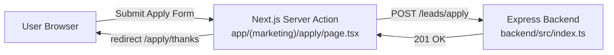

# oksia


Premium platform for structured business growth, mindset development, and AI-enabled execution.

This repository is a small monorepo:

- **Frontend**: Next.js (App Router) + TypeScript + TailwindCSS
- **Backend**: Node.js + Express (TypeScript)

> Notes
>
>- The project is currently an MVP with demo data and a lead capture flow.
>- Authentication and database persistence are planned (see Roadmap).

---

## Contents

- [Overview](#overview)
- [Architecture](#architecture)
- [Tech Stack](#tech-stack)
- [Repository Structure](#repository-structure)
- [Quick Start](#quick-start)
- [Environment Variables](#environment-variables)
- [Scripts](#scripts)
- [Backend API](#backend-api)
- [Deployment](#deployment)
- [Lint and Build](#lint-and-build)
- [Development Notes](#development-notes)
- [Roadmap](#roadmap)
- [Contributing](#contributing)

---

## Overview

The **oksia** web app includes:

- A marketing website (Hebrew, RTL)
- A dashboard demo (UI only)
- An Apply (lead capture) flow

The Apply form uses a **Next.js Server Action** (server-side) that forwards the payload to the separate **Express backend**.

---

## Architecture

### Visual Flow (Apply → Server Action → Backend)



---

## Tech Stack

### Frontend

- **Next.js** (App Router)
- **React**
- **TypeScript**
- **TailwindCSS**
- **ESLint**

### Backend

- **Node.js**
- **Express**
- **TypeScript**
- **tsx** (dev runner)

---

## Repository Structure

```
.
├─ app/                       # Next.js App Router routes (marketing/auth/dashboard)
├─ components/                # Reusable UI components
├─ lib/                       # Shared helpers + demo data
├─ public/                    # Static assets
├─ scripts/                   # Dev scripts (e.g. dev:all)
├─ backend/                   # Separate Express backend (TypeScript)
│  ├─ src/
│  ├─ package.json
│  └─ tsconfig.json
├─ package.json               # Frontend scripts + dev:all
└─ eslint.config.mjs
```

---

## Quick Start

### Prerequisites

- **Node.js 20+** (Node 22 works)
- **npm**

### 1) Install dependencies

Frontend (root):

```bash
npm install
```

Backend:

```bash
cd backend
npm install
```

### 2) Run development servers

Option A: run both with one command (recommended)

```bash
npm run dev:all
```

Option B: run separately in two terminals

Terminal 1 (frontend):

```bash
npm run dev
```

Terminal 2 (backend):

```bash
cd backend
npm run dev
```

Frontend runs on:

- `http://localhost:3000`

Backend runs on:

- `http://localhost:4000`

---

## Environment Variables

This repo includes example files:

- `.env.example` (frontend/root)
- `backend/.env.example` (backend)

Copy them to your local env files as needed.

### Frontend

- **`BACKEND_URL`**
  - URL for the external backend used by Server Actions.
  - Default (if not set): `http://localhost:4000`

- **`NEXT_PUBLIC_BACKEND_URL`**
  - Optional alternative to `BACKEND_URL`.
  - Use only if you explicitly want the backend URL accessible to client-side code.

- **`NEXT_PUBLIC_CALENDLY_URL`**
  - Used on the Apply page.
  - If missing, a mailto fallback is used.

- **`NEXT_PUBLIC_WHATSAPP_URL`**
  - WhatsApp link used on the Apply page.
  - If missing, a default `wa.me` link is used.

### Backend

Backend environment variables are read from the process environment.

- **`PORT`**
  - Server port.
  - Default: `4000`

---

## Scripts

### Frontend (root)

- **`npm run dev`**: Start Next.js dev server
- **`npm run dev:all`**: Start both frontend and backend together (runs `scripts/dev-all.mjs`, which spawns `npm run dev` in the root and in `backend/`)
- **`npm run lint`**: Run ESLint
- **`npm run build`**: Production build
- **`npm run start`**: Start production Next server

### Backend (`backend/`)

- **`npm run dev`**: Start Express server in watch mode (`tsx watch`)
- **`npm run build`**: Build TypeScript to `backend/dist`
- **`npm run start`**: Run production server from `backend/dist`

---

## Backend API

Base URL (local): `http://localhost:4000`

### Health

- `GET /health`

Response:

```json
{ "ok": true }
```

### Lead capture

- `POST /leads/apply`

Request body (JSON):

```json
{
  "fullName": "...",
  "phone": "...",
  "email": "...",
  "businessName": "...",
  "goal": "...",
  "challenge": "...",
  "track": "..."
}
```

Current behavior:

- Logs the payload to the backend console
- Returns `201 { ok: true }`

---

## Deployment

Recommended setup:

- **Frontend**: deploy to Vercel
  - Set `BACKEND_URL` to your backend public URL
  - Set any `NEXT_PUBLIC_*` variables you use in the UI

- **Backend**: deploy to a Node-friendly platform (Render / Railway / Fly.io / VPS)
  - Set `PORT` (or use the platform default)
  - Ensure your service is reachable from the Vercel frontend

Notes:

- Today the backend has no database; it only logs leads.
- When adding a DB, prefer a managed database and keep credentials in backend-only environment variables.

---

## Lint and Build

Run lint:

```bash
npm run lint
```

Build frontend:

```bash
npm run build
```

Notes:

- The root ESLint and TypeScript configuration ignores `backend/**`.
- Backend has its own TypeScript config under `backend/tsconfig.json`.

---

## Development Notes

- **RTL / Hebrew UI**: The app is configured for Hebrew and RTL at the root layout.
- **No secrets in Git**: Do not commit `.env*` files.
- **Server Actions**: The Apply form submission is server-side, then forwarded to the backend.
- **Backend is separate**: Treat `backend/` like a standalone service with its own install/build.
- **Shared code**: shared helpers live under `lib/`. If you add shared types later, keep them in `lib/types` (or a dedicated package).
- **Monorepo tooling (optional)**: if this grows, consider adopting `npm workspaces` so you can install/run packages from the root with a single command.

---

## Roadmap

High-level planned work:

- Authentication (credentials, Google, Magic Link)
- Database persistence (users, tasks, sessions, files, courses)
- AI Center integration (secured API calls and audit-friendly workflows)
- Admin tools for lead management

---

## Contributing

If you plan to collaborate via GitHub:

- Create a feature branch per change
- Keep PRs small and focused
- Prefer TypeScript and strict typing
- Run `npm run lint` before opening a PR

---

## Contact

Oren Peretz

LinkedIn: https://www.linkedin.com/in/oren-peretz

Email: info@oksia.ai
